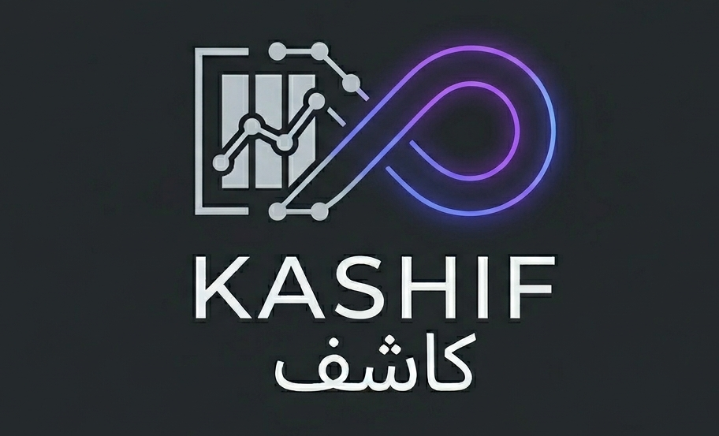

# Kashif — كاشف

> *The Uncoverer*



**GitHub:** [silvaxxx1/Kashif_Agent](https://github.com/silvaxxx1/Kashif_Agent)

Kashif is a data science agent that wraps a robust static AutoML pipeline with an LLM-powered feature engineering loop. Give it a CSV and a target column. It figures out the rest.

---

## Philosophy

### The old way still works

Classical data science has a core that is not broken. A well-built sklearn pipeline with proper cross-validation, leak-free preprocessing, and a leaderboard of models is still how production tabular ML gets done. This is not legacy — it is engineering discipline. Most of what AutoML got right is in this pipeline.

Kashif does not replace it. It starts there.

### The new part is reasoning, not automation

Feature engineering is where the old way runs out. You cannot grid-search your way to a good interaction feature. You cannot rule-base your way to the right domain transformation. You need to look at the data, think about what it represents, and write code that encodes that understanding.

That reasoning is exactly what language models are good at.

Kashif gives the LLM the data profile — column names, types, distributions, null rates, target correlation — and asks it to write `engineer_features(df) -> df`. That code runs in a sandbox, the transformed DataFrame goes through the same static pipeline, and cross-validation gives an honest score. The LLM sees the result, sees what SHAP says was useful, and tries again.

This is not prompt-and-hope. It is a loop with a memory, a score, and a stopping condition.

### Inspired by Karpathy's autoresearch pattern

The loop design is directly inspired by Andrej Karpathy's [autoresearch](https://github.com/karpathy/llm.c/tree/master/autoresearch) experiment — an autonomous agent that iteratively improves a training script by reading its own results and rewriting the code.

The key insight from that work: **give the model everything, every time**. Not just the last result — the full history. Every previous attempt, every score, every failure. The model accumulates context the way a researcher would across a working session. The loop runs until improvement flattens.

Kashif applies this pattern to tabular ML with one critical adaptation: the editable artifact is scoped to a single function. The LLM writes `engineer_features(df) -> df` and nothing else. The pipeline, the CV harness, the model — all static. The agent touches exactly one thing, and that thing is the one that requires reasoning.

### The right boundary

| Static — engineering discipline | LLM — reasoning required |
|---|---|
| Data cleaning | Feature engineering code |
| Encoding and scaling | Reflection on what worked |
| Cross-validation (no leakage) | Stopping decision |
| Model selection and training | Report narrative |
| Pickle output | Reading domain hints from `program.md` |

The boundary is not arbitrary. Everything on the left has a correct answer that code can compute. Everything on the right requires understanding the data, the domain, and the history of what was tried.

---

## How it works

The static pipeline — cleaning, encoding, scaling, cross-validation — never changes. It is deterministic and leak-free. The LLM owns exactly one thing: writing and improving `engineer_features(df) -> df`. Every round it receives the full history: every previous attempt, every score, every dead feature. When improvement drops below 0.5%, it stops.

---

## Two interfaces, one engine

Kashif is built for two different users on top of the same core engine.

**The CLI** is for data scientists and engineers. Full control — pick the LLM provider, set the number of rounds, disable the agent for a pure static run, inspect the JSON output, pipe it into other tools. Zero UI overhead.

```bash
kashif run --csv data.csv --target churn
kashif run --csv data.csv --target price --rounds 4 --llm anthropic
kashif run --csv data.csv --target survived --no-agent
```

**The UI** is for domain experts who should not need to touch a terminal. Upload a CSV, name the target column, edit `program.md` in a text box, hit run. The same JSON contract that feeds the CLI renders as a live dashboard: score progression, top features per round, downloadable model.

The engine produces exactly one output format. It has no opinion about who called it. Both interfaces are thin shells around the same `train()` call.

---

## Architecture

```
  data.csv
      │
      ▼
  profiler.py          ← dtype audit, null rates, cardinality, skew,
      │                   task detection (classification vs regression)
      │  profile_json
      ▼
  fe_agent.py          ← LLM reads profile + program.md + all previous rounds
      │                   writes engineer_features(df) -> df
      │  fe_code
      ▼
  executor.py          ← sandboxed exec, catches all errors, fallback to identity
      │  transformed_df
      ▼
  trainer.py           ← Pipeline(cleaning → fe_transform → processing → model)
      │                   CrossValidator clones full pipeline per fold — no leakage
      │  cv_score, SHAP, oof_preds
      ▼
  fe_agent.py          ← reflection: score delta + SHAP + dead features → new code
      │
      · · · rounds until delta < 0.005 or max_rounds reached
      │
      ▼
  reporter.py          ← score progression, top features, final recommendation
      │  report.md
      ▼
  JSON output contract
```

The loop runs inside the agent. The pipeline runs inside sklearn. Neither knows about the other except through the DataFrame they pass between them.

---

## What the LLM owns vs what the code owns

| Static — deterministic | LLM-owned — reasoning required |
|---|---|
| Data loading | Feature engineering code |
| Type detection | Reflection on what worked |
| Null/variance/cardinality cleaning | Stopping decision |
| Encoding and scaling | Report narrative |
| Cross-validation | Reading `program.md` domain hints |
| Pickle output | Deciding what to drop vs keep |

---

## Provider-agnostic LLM layer

The agent never imports a provider SDK directly. `fe_agent.py` holds a `BaseLLM` reference only. The concrete provider is resolved at startup from `config.yaml`.

```yaml
llm:
  provider: groq                    # groq | anthropic | ollama
  model: llama-3.3-70b-versatile
  api_key_env: GROQ_API_KEY
  temperature: 0.2
```

Groq is the default — fastest inference, OpenAI-compatible API, cheapest per token at scale. Swap to Anthropic or a local Ollama model with one config line.

---

## Output contract

Every run — CLI, API, or direct Python — returns the same structure:

```json
{
  "status": "complete",
  "best_round": 3,
  "cv_score": 0.891,
  "baseline_score": 0.821,
  "delta": 0.070,
  "model_path": "./outputs/best_model.pkl",
  "feature_schema": "./outputs/feature_schema.json",
  "top_features": ["age_x_salary", "dept_encoded"],
  "dead_features": ["col_x", "col_y"],
  "rounds": [
    {"round": 1, "cv_score": 0.841, "fe_code": "..."},
    {"round": 2, "cv_score": 0.871, "fe_code": "..."},
    {"round": 3, "cv_score": 0.891, "fe_code": "..."}
  ],
  "report_path": "./outputs/report.md"
}
```

The CLI prints it formatted. A future API returns it as JSON. A future UI renders it as a dashboard. The engine never knows or cares who called it.

---

## Usage

```bash
# Install
cd kashif_core
uv add scikit-learn pandas numpy shap typer openai anthropic pytest

# Run (static pipeline only, no agent)
uv run python -m cli.main run --csv data.csv --target survived --no-agent

# Run with LLM feature engineering loop (default: Groq)
uv run python -m cli.main run --csv data.csv --target survived

# Override provider
uv run python -m cli.main run --csv data.csv --target price --llm anthropic

# Control rounds
uv run python -m cli.main run --csv data.csv --target churn --rounds 4
```

Environment variables required:

```bash
export GROQ_API_KEY=...          # default provider
export ANTHROPIC_API_KEY=...     # if provider: anthropic
```

---

## Domain hints — program.md

`program.md` is the user's interface to the LLM. It is not code and not loop mechanics — it is domain knowledge that travels into every LLM prompt:

```markdown
## Goal
Predict customer churn. Target is binary: 1 = churned within 30 days.

## Column notes
- `tenure_months`: time as customer — high signal, use as-is and in ratios
- `last_login_days`: days since last activity — engineer decay features
- `plan_id`: nominal, no ordinal meaning — do not treat as numeric

## Avoid
- `customer_id` — identifier, no signal
- `signup_date` — already encoded as tenure_months

## Evaluation priority
Recall matters more than precision here. Missing a churn is costlier than a false alarm.
```

Edit `kashif_core/program.md` before running. Leave it blank and the agent works from column statistics alone.

---

## Tech stack

| Layer | Tool |
|---|---|
| Environment | uv |
| ML pipeline | scikit-learn |
| Data | pandas, numpy |
| Explainability | shap |
| CLI | typer |
| LLM default | Groq — openai SDK + Groq base URL |
| LLM secondary | Anthropic SDK |
| LLM future | Ollama (local inference) |
| Testing | pytest |
| API (planned) | fastapi + uvicorn |
| UI (planned) | TBD |

---

## Build status

The project is being built one module at a time. Each module requires a passing test suite before the next one starts.

**Layer 1 — Core engine**

| Module | What it does | Status |
|---|---|---|
| `core/trainer.py` | Static sklearn pipeline: cleaning, encoding, CV, model registry | **complete** — 34/34 tests |
| `core/profiler.py` | Data profiling + task detection + EDA HTML report | **complete** — 34/34 tests |
| `core/executor.py` | Sandboxed code execution + fallback guard | **complete** — 38/38 tests |
| `core/llm/` | Provider-agnostic LLM adapter layer (Groq + Anthropic) | **complete** — 29/29 tests |
| `core/fe_agent.py` | LLM feature engineering loop + reflection | **complete** — 36/36 tests |
| `core/reporter.py` | Markdown report from experiment log | **complete** — 42/42 tests |

**Layer 2 — Interfaces**

| Interface | What it does | Status |
|---|---|---|
| `cli/main.py` | Typer CLI — full control for data scientists | **complete** — 25/25 tests |
| `api/` | FastAPI wrapper — serves the JSON contract over HTTP | not started |
| `ui/` | Web UI — upload CSV, run, see dashboard (no terminal required) | not started |

**252/252 tests passing. Step 4 complete.**

The two interface layers (API, UI) are built last — they are thin shells around the same engine.

---

## Smoke tests — real datasets

```bash
# Classification: Breast Cancer Wisconsin (569 rows, 30 features)
uv run python scripts/smoke_classification.py

# Regression: California Housing (20,640 rows, 8 features)
uv run python scripts/smoke_regression.py

# Integration: Titanic (891 rows) — static pipeline + LLM FE loop via Groq
uv run python scripts/smoke_integration.py
```

Results:

| Dataset | Mode | Best model | Score |
|---|---|---|---|
| Breast Cancer | static | Logistic Regression | 97.4% accuracy |
| California Housing | static | Random Forest | RMSE 0.50, R² 0.81 |
| Titanic | LLM FE (Groq) | Random Forest | 77.2% accuracy (+6.9% over baseline) |

---

## Running tests

```bash
# All tests
uv run pytest tests/ -v

# Single module
uv run pytest tests/test_trainer.py -v

# Single test
uv run pytest tests/test_trainer.py::TestTrain::test_classification_end_to_end -v
```

---

## Project structure

```
kashif_core/
├── core/
│   ├── trainer.py       static pipeline — cleaning, CV, model registry
│   ├── profiler.py      data profiling + task detection
│   ├── executor.py      sandboxed code execution
│   ├── fe_agent.py      LLM feature engineering loop
│   ├── reporter.py      markdown report generator
│   └── llm/
│       ├── base.py      abstract BaseLLM interface
│       ├── groq.py      Groq adapter (default)
│       ├── anthropic.py Anthropic adapter
│       └── ollama.py    local model adapter
├── cli/
│   └── main.py          typer CLI entry point
├── tests/
│   ├── test_trainer.py       34 tests — static pipeline
│   ├── test_profiler.py      34 tests — profiling + task detection
│   ├── test_executor.py      38 tests — sandboxed executor
│   ├── test_llm.py           29 tests — LLM adapters
│   ├── test_fe_agent.py      36 tests — FE agent loop
│   └── test_reporter.py      42 tests — markdown reporter
├── scripts/
│   ├── smoke_classification.py   end-to-end test on breast cancer dataset
│   ├── smoke_regression.py       end-to-end test on California housing dataset
│   └── smoke_integration.py      full LLM loop test on Titanic dataset
├── outputs/             model artifacts, reports, logs (gitignored)
├── config.yaml          LLM provider, CV folds, cleaning thresholds
├── program.md           user domain hints (edit before running)
└── pyproject.toml       uv manages this
```
